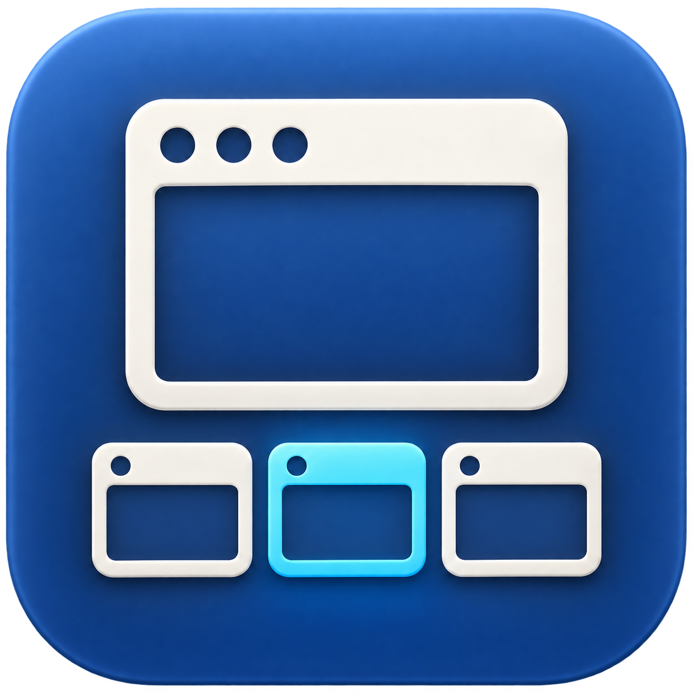

<p align="center"></p>

# Rowla

**Every window within reach.** Pronounced **ROH-luh**.

A free, open-source Windows-style taskbar for macOS. One button per window, cached hover previews, and your preferred app order one click away.
Built for people who keep many windows open and want a predictable place to find them.

[](https://github.com/sharifhsn/rowla/actions/workflows/ci.yml)
[](LICENSE)
[](USER_GUIDE.md#requirements)

[**Download the Apple Silicon beta**](https://github.com/sharifhsn/rowla/releases/download/v0.2.0-beta.2/Rowla-0.2.0-beta.2-macos-arm64.zip) · [User guide](USER_GUIDE.md) · [Ask a question](https://github.com/sharifhsn/rowla/discussions) · [Contribute](CONTRIBUTING.md)

> **Beta:** macOS 15.2+ and Apple Silicon. The download uses a development certificate and has no Apple notarization.
> macOS can require **Open Anyway** on first launch. Updates use manual downloads.

[macOS compatibility](docs/COMPATIBILITY.md) · [Full capabilities and limits](docs/CAPABILITIES.md)

## Your windows, in your order

| Control | What it does |
| --- | --- |
| **Window buttons** | Shows each window with a compact, single-line title. Click to activate or restore it. |
| **Sort**, beside Start | Restores your configured app order. Recent main windows come before popups within each app. |
| **Hover preview** | Shows a cached thumbnail immediately. A fresh capture needs time. |
| **Hover ⌘W** or the small **×** | Closes that window, including minimized windows. The app can ask you to save changes. |
| **Hover ⌘Q** | Quits the application that owns the hovered window, bubble, or thumbnail. |
| **Related-window bubbles** | Shows related utility windows and native tabs as small controls on their main tile. Tab changes preserve the tile position. |
| **Chrome profile badges** | Adds a small local profile photo or initial to matched Chrome window icons. |
| **Pinned apps** | Shows launch icons when the app has no discovered window. |
| **Start** | Searches installed apps, with pinned/recent lists and arrow-key navigation. |
| **Window context menu** | Provides minimize/restore, fullscreen, app hide/quit, pins, and exclusions. |
| **Display and Space behavior** | Provides per-display bars and current-Space window visibility. Can show all display windows on every bar. |
| **Shortcuts** | Includes install buttons for Sort Windows, Show Taskbars, and Hide Taskbars. Run the saved shortcuts with a keyboard shortcut or Spotlight. |
| **Appearance and optional system controls** | Provides themes, scale, fonts, transparency, login registration, Dock hiding, and overlap resize. |

Sort acts when you click it. It gives you a way to reset a busy window strip to a familiar order.
Close controls close the selected window. They do not quit its application.
Read the [capability tables](docs/CAPABILITIES.md) for access paths, defaults, permissions, and application-specific limits.
Read the [macOS feature assessment](docs/MACOS_FEATURE_RESEARCH.md) for the API selection and version requirements.

## Install

1. Download the beta ZIP and extract `Rowla.app`.
2. Move the app to Applications.
3. Open Rowla.
4. If macOS blocks it, use **System Settings → Privacy & Security → Open Anyway** for Rowla.
5. Grant **Accessibility** access for window controls.
6. For thumbnails, grant **Screen Recording** access.
7. Quit and reopen Rowla if macOS requests it after a permission change.

[Apple describes Open Anyway](https://support.apple.com/en-us/102445). Some managed Macs prohibit this exception. Keep Gatekeeper and SIP enabled.
Use the menu-bar icon for Preferences or Quit. Start at login and automatic window resizing are off for fresh preferences.

[Release notes and checksums](https://github.com/sharifhsn/rowla/releases/tag/v0.2.0-beta.2) · [Installation help](docs/SUPPORT.md#first-launch-problems)

## Privacy and resources

Rowla needs no account and has no telemetry. Preview images stay in memory.
The thumbnail cache has a **16 MiB / 32-image limit**. Native capture buffers and other app objects use more memory.
This limit is not a limit on total process memory. Read the [privacy statement](PRIVACY.md).

## Help shape Rowla

You can contribute with documentation, a useful bug report, device checks, design feedback, or code.
New contributors and AI-assisted contributions are welcome. You do not need to know Rust to help.
Contributors review and take responsibility for the work they submit.

| You want to… | Start here |
| --- | --- |
| Get help or discuss a workflow | [Discussions](https://github.com/sharifhsn/rowla/discussions) and [support guide](docs/SUPPORT.md) |
| Report a bug or performance problem | [Issue forms](https://github.com/sharifhsn/rowla/issues/new/choose) |
| Make a first contribution | [Contribution guide](CONTRIBUTING.md), [good first issues](https://github.com/sharifhsn/rowla/labels/good%20first%20issue), and [roadmap](docs/ROADMAP.md) |
| Use a coding agent | [AGENTS.md](AGENTS.md), with entry points for [Copilot](.github/copilot-instructions.md) and [Claude Code](CLAUDE.md) |
| Report a security problem | [Private vulnerability report](https://github.com/sharifhsn/rowla/security/advisories/new) |

Please read the [community conduct policy](CODE_OF_CONDUCT.md). Remove private information from public reports and screenshots.

## Build from source

Use macOS 15.2+, Xcode Command Line Tools, Python 3, and [Rust through rustup](https://rustup.rs/).
The repository pins Rust 1.96.0 and all Cargo dependencies.

```sh
git clone https://github.com/sharifhsn/rowla.git
cd rowla
scripts/build.sh
open dist/Rowla.app
```

The build script downloads Sparkle 2.10.0 and checks its pinned checksum and signature.
A fresh checkout uses an ad-hoc signature and needs no Apple Developer membership.
Changed ad-hoc builds can need new permission grants. See [local certificates](docs/RELEASE.md#local-signatures-and-permissions) for repeated builds.

See [CONTRIBUTING.md](CONTRIBUTING.md) for checks and native tests. Linux supports the portable library checks, not the macOS app.
The [release tag](https://github.com/sharifhsn/rowla/tree/v0.2.0-beta.2) preserves the shipped source.
The original beta and its source tag remain available in the release history.

<details>
<summary><strong>Compatibility and known beta limits</strong></summary>

- The public beta download supports Apple Silicon and macOS 15.2+. Intel builds pass CI, but Intel live controls need independent tests.
- A minimized window uses its last captured preview. A window minimized before its first capture can have no thumbnail until restoration.
- Displays, Spaces, sleep/wake, fullscreen, and application-specific window controls need broader feedback.
- Optional private window and Spaces functions can change across macOS releases.
- Finite local memory profiles do not prove that all future paths are free of leaks or spikes.
- The internal executable is `taskbar-rs`. The bundle identifier and legacy preferences path preserve compatibility with earlier Taskbar Rust builds.
- Quit an earlier build before Rowla. They share preferences and an instance lock. Quit Rowla before an app-bundle replacement.

</details>

## License and acknowledgments

Rowla uses the [MIT license](LICENSE). You can use, modify, and redistribute it with the required notices.
Distributions include [third-party notices](THIRD_PARTY_NOTICES.md). The app icon was generated for this project.
Rowla is an independent implementation inspired by [Taskbar](https://lawand.io/taskbar/), with no affiliation to lawand.io or Apple.
